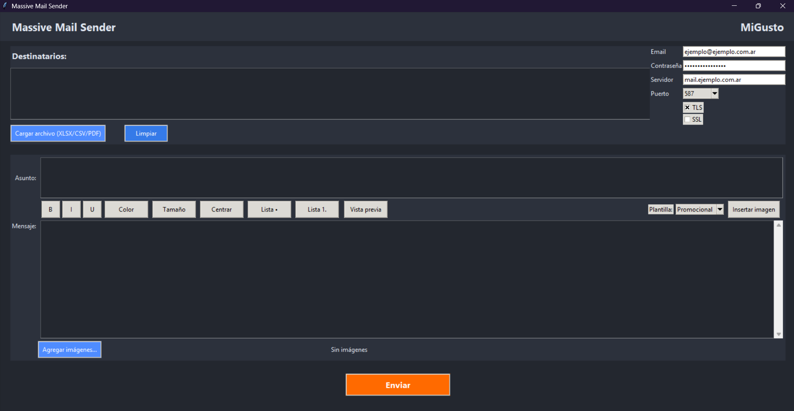
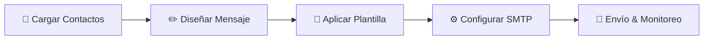

  

  <h1>📨 Massive Mail Sender</h1>
  
<strong>Solución integral de escritorio para la gestión y ejecución de campañas de email marketing masivo</strong>

  

    
    
    
    
  

   

  

 

---

## 🎯 Descripción General

**Massive Mail Sender** es una potente aplicación de escritorio desarrollada para optimizar y simplificar los envíos de correos electrónicos a gran escala. Diseñada pensando en la productividad de los equipos de marketing y comunicación, combina la flexibilidad de un **editor WYSIWYG enriquecido** con la robustez de un motor SMTP multi-protocolo.

Permite personalizar mensajes, incrustar recursos multimedia dinámicos, aplicar temas visuales de alto impacto y procesar listas masivas de contactos desde diversas fuentes de datos sin complicaciones técnicas.

---

## ✨ Características Destacadas

### 🎨 Editor Enriquecido & Personalización Visual
- **Formateo Avanzado:** Edición WYSIWYG con control completo sobre fuentes, tamaños, paleta de colores, alineación, negrita, cursiva, subrayado y enlaces superpuestos.
- **Asuntos Dinámicos Multilínea:** Formateo y organización fluida de asuntos para maximizar la tasa de apertura (*Open Rate*).
- **Imágenes Inline (CID Embedding):** Inserción transparente de imágenes en el cuerpo del correo mediante marcadores dinámicos (`{{image1}}`, `{{image2}}`), garantizando que se muestren correctamente en cualquier cliente de correo sin bloquearse como adjuntos externos.

### 📑 Galería de Plantillas Prediseñadas
Estilos HTML optimizados y *responsive* listos para aplicar con un solo clic:
- 🍦 **Vanilla:** Formato limpio y nativo sin envoltorios HTML adicionales.
- 📣 **Promocional:** Diseñado para destacar ofertas, lanzamientos y llamadas a la acción (*CTA*).
- 💼 **Corporativa:** Estilo profesional, estructurado y sobrio para comunicaciones oficiales.
- 🌿 **Minimalista:** Diseño enfocado en la lectura clara y directa del mensaje.
- 🎃 **Halloween & 🎄 Navidad:** Maquetaciones temáticas estacionales para campañas especiales.

### 📥 Importación Inteligente de Contactos
Procesamiento automatizado de bases de datos de destinatarios desde múltiples formatos:
- 📊 **Excel (.xlsx) y CSV:** Lectura directa y rápida de hojas de cálculo.
- 📄 **Extracción desde PDF:** Parsing automatizado de texto para detectar y extraer direcciones de correo válidas.
- 🌐 **Google Sheets Integration:** Conexión directa mediante API para trabajar con hojas en la nube en tiempo real.
- 🛡️ **Validación de Sintaxis:** Filtro en tiempo real para descartar correos con formato inválido antes de iniciar el envío.

### ⚙️ Motor SMTP & Monitoreo en Tiempo Real
- **Soporte Multi-Puerto:** Configuración ágil de puertos estándar `587` (STARTTLS) y `465` (SSL) con ajuste automático de seguridad.
- **Panel de Progreso:** Seguimiento visual del envío correo por correo con indicador de tasa de éxito.
- **Reporte Final de Auditoría:** Resumen al finalizar la campaña especificando envíos exitosos, fallidos y causas de error.

---

## 🚀 Flujo de Trabajo

1. **Importación:** Selecciona tu lista de destinatarios (Excel, CSV, PDF o Google Sheets).
2. **Composición:** Redacta el asunto y el mensaje usando las herramientas de estilo e inserta marcadores de imagen (`{{image1}}`, etc.).
3. **Estilo:** Elige la plantilla HTML que mejor se adapte al objetivo de tu campaña.
4. **Conexión:** Verifica las credenciales SMTP de tu servidor.
5. **Ejecución:** Inicia el proceso masivo y analiza el reporte final de entrega.

---

  Desarrollado para optimizar comunicaciones masivas con máxima eficiencia.

